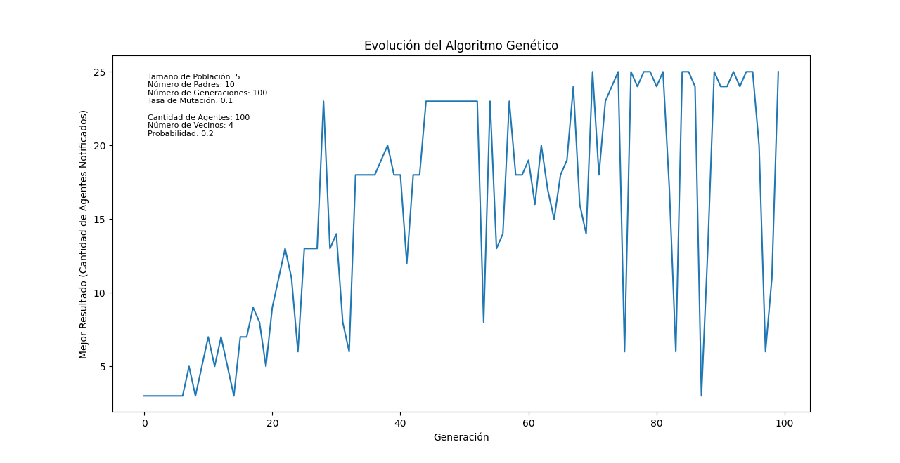
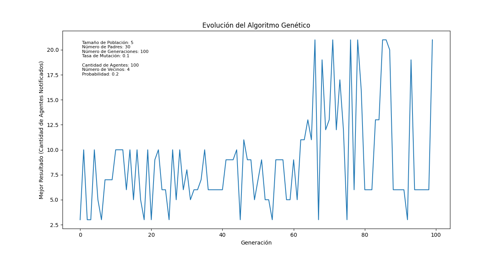
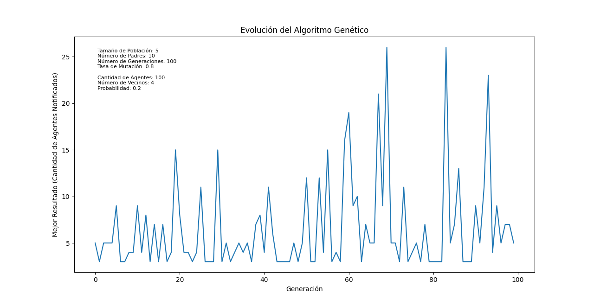
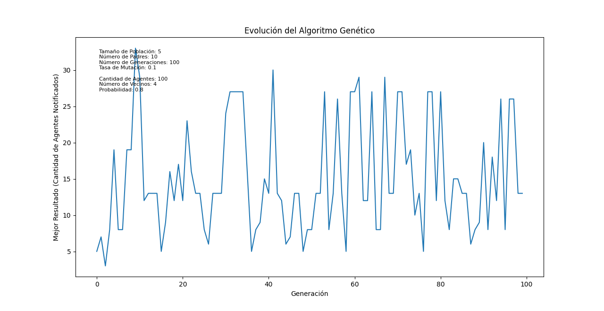
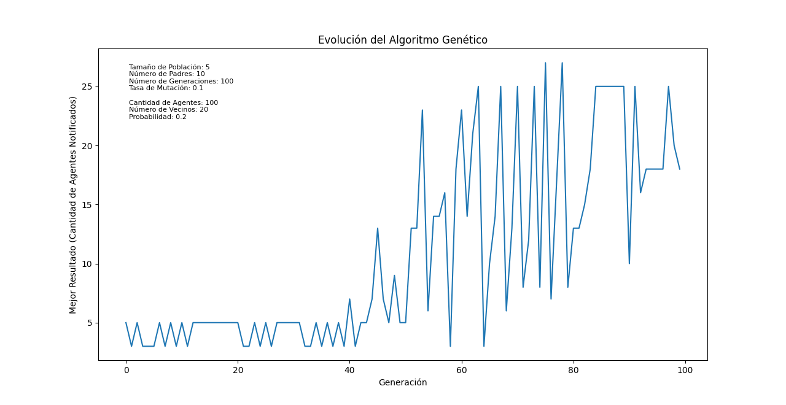

# ``Informe del proyecto de IA con Simulación: Propagación de mensajes entre agentes``

### **Introducción**
El objetivo principal de este proyecto es desarrollar un sistema que, a través de la simulación de la propagación de un mensaje, permita evaluar y mejorar la estructura de los mensajes de comunicación. Este enfoque se basa en la premisa de que la simulación puede proporcionar una plataforma para experimentar con diferentes estructuras de mensajes y analizar cómo estas afectan la adopción del mensaje por parte de los agentes en un sistema. Al hacerlo, este proyecto busca contribuir a la comprensión de cómo los mensajes pueden ser diseñados para ser más efectivos en términos de consenso y adopción.

### **Representación de problema**

Representación de una red social a través de un grafo de mundo pequenno, donde los nodos son personas y los enlaces son la relación entre ellos.
- ``Grafo de mundo pequeño``:  Grafo para el que la mayoría de los nodos no son vecinos entre sí y sin embargo la mayoría de los nodos pueden ser alcanzados desde cualquier nodo origen a través de un número relativamente corto de saltos entre ellos. 
Las redes sociales suelen exhibir propiedades de mundo pequeño, como alta conectividad, breves distancias medias y alto agrupamiento local. Estas propiedades se reflejan en la estructura de un grafo de mundo pequeño, lo que lo convierte en una representación adecuada de la red social real.

### **Representacionde los agentes: `class Agent`**

La clase Agent define la estructura y el comportamiento de los agentes individuales en la simulación. 
Cada agente posee un conjunto de creencias, reglas de decisión y una red de vecinos con los que interactúa. Al recibir un mensaje, el agente lo analiza mediante la deliberación, utilizando sus creencias, interés en el tema y acuerdo con el mensaje para decidir si transmitirlo, alterarlo o descartarlo. La acción elegida se ejecuta enviando el mensaje modificado (o un nuevo mensaje) a sus vecinos y reportando el resultado; de esta forma es posible modelar agentes con diversos comportamientos y explorar cómo estos influyen en la propagación de información en la red.

- ``Creencias (Beliefs)``: Cada creencia esta compuesta por:
    - Tema: Tema del mensaje que prepresenta.
    - Opinion: Valor numérico que representa, en el caso de los agentes, si tiene una opinión favorable o desfavorable respecto al tema (ej.: positivo, negativo, neutral, representado numéricamnete en el rango discreto de -2 a 2).

### **Representacion de un mensaje: `class Message`**

- ``Composición del Mensaje:``

    -`` Fuerza:`` Valor numérico que indica aproximadamente cuánto baja en DFS un mensaje en el grafo.
    - ``Creencias:`` Conjunto de `Belief` que representan los temas abordados en el mensaje y las opiniones asociadas a cada uno (ej.: positivo, negativo, neutral, representado numéricamnete en el rango discreto de -2 a 2).
    - ``Origen y Destino:`` Identificadores que indican el emisor y receptor del mensaje, respectivamente.

- ``Funcionalidades:``
Permite modificar el valor numérico que representa la importancia del mensaje y proporciona métodos para cambiar la opinión sobre un tema específico o fortalecer/debilitar la intensidad de dicha opinión. Habilita la generación de una réplica exacta del mensaje original para preservar información o crear variaciones.

### **Modificacion de un mensaje: `class DecisionRule`** 
- ``Reglas de decision:`` Cada regla de decisión define de forma unica la manera de alterar un mensaje en dependencia de la decision que define la regla (de acuerdo, en desacuerdo, intermedio).

    - ``AgreementWithMessageRule ``(Transmitir sin Alterar): Transmite el mensaje sin cambios si hay un alto acuerdo e interés en los temas.
    - ``DisagreementWithMessageRule`` (No Transmitir): No transmite el mensaje si hay un alto desacuerdo en los temas y el interés es alto (evita propagar información con la que   no están de acuerdo los agentes).
    - ``AdjustMessageRule`` (Ajustar Mensaje): Ajusta el mensaje en función del acuerdo moderado en los temas y el interés. Aumenta la intensidad de las opiniones con las que hay acuerdo y disminuye la intensidad de las que generan desacuerdo.

### **Modelo de simulación**

El proyecto simula un entorno donde los agentes interactúan entre sí intercambiando mensajes. Cada mensaje tiene un tema y una valoración numérica que indica la opinión sobre el tema. Los agentes poseen creencias sobre los temas y reglas de decisión que determinan cómo reaccionan a los mensajes recibidos; siendo la clase `Enviroment` el centro de la simulación. Esta clase representa el entorno en el que se desarrolla la interacción entre los agentes. Su diseño utilizando el patrón *Singleton* garantiza que exista una única instancia del entorno de la simulación en todo el programa, asegurando una ejecución controlada y consistente (algo similar pasa con la clase `Report`).

### **Ejecución de la simulación**

La simulación comienza con un mensaje inicial que se propaga entre los agentes. A medida que los agentes reciben mensajes, actualizan sus creencias y envían respuestas de acuerdo a sus reglas de decisión. La simulación termina cuando el mensaje ya no tiene suficiente fuerza para seguir propagándose o cuando se alcanza un criterio de parada predefinido.

### **Resultados de la simulación**

- Grado de propagación del mensaje: A cuantos agentes llega el mensaje.
- Nivel de aceptación del mensaje: Que cantidad de agentes estan de acuerdo con el mensaje.

### **Componente de procesamiento de lenguage natural:**

- `Libreria google.generativeai`: Permite la creación de aplicaciones de IA generativa basada en modelos de última generación como Gemini, de Google AI.
- ``Uso``: Obtención de un mensaje estructurado a partir de un mensaje en lenguaje natural y viceversa (con un mensaje alterado obtención de un mensaje en lenguaje natural).

<!-- ### **Componente de búsqueda: `class Cupid`**

El objetivo del agente es encontrar parejas compatibles entre los demás agentes presentes en la simulación basado en la creencias de los mismos. Para ello se utiliza un algoritmo de programación lineal entera para resolver un problema de satisfacción de restricciones. -->

### **Componente de búsqueda: ``Algoritmo Genético``**

- ``genetic_algorithm()``:
    - El algoritmo genético se inicia generando una población inicial de mensajes de manera aleatoria.
    - En cada generación, el algoritmo evalúa la "aptitud" de cada mensaje en la población basado en el grado de propagación del mensaje mediante la funcion ``get_notified_agents_count()`` o en el nivel de aceptación del mensaje a través de la funcion `get_agreement_agents_count()`. 
    - Posteriormente, selecciona los mejores mensajes como padres y crea una nueva generación de mensajes a través de un proceso que incluye:
        - Cruce: Cada creencia del padre se selecciona con una probabilidad p.
        - Mutación: Cada creencia del padre se modifica con una probabilidad p.

    Este proceso se repite durante un número específico de generaciones, permitiendo que los mensajes evolucionen y se ajusten para mejorar su capacidad de ser adoptados por la mayoría de los agentes en el sistema. Al final del proceso, el algoritmo retorna el mejor mensaje encontrado y una lista de los mejores resultados a lo largo de las generaciones. 

