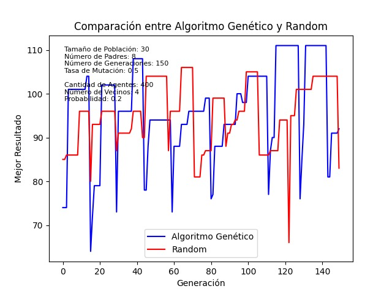
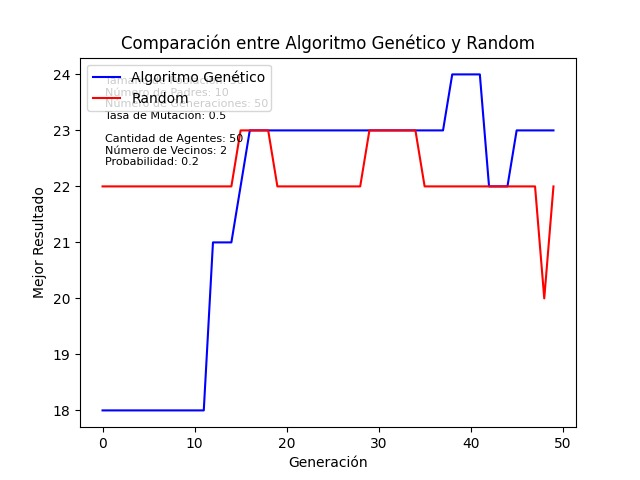

# Informe
### Autores:
- Loitzel Ernesto Morales Santiestebans C311
- Leonardo Javier Ramirez Calatayud C311
- Naomi Lahera Champagne C311
### Campos:
- IA 
- Simulación 
### Tema: Detección de un mensaje óptimo en el proceso de propagación de la información.

### **Introducción**
En el ámbito de la comunicación y la toma de decisiones, la eficacia de los mensajes es un factor crítico que puede influir significativamente en el éxito de una campaña o en la adopción de una idea.

El objetivo principal de este proyecto es desarrollar un sistema que, a través de la simulación de la propagación de un mensaje, permita evaluar y mejorar la estructura de los mensajes de comunicación. Este enfoque se basa en la premisa de que la simulación puede proporcionar una plataforma para experimentar con diferentes estructuras de mensajes y analizar cómo estas afectan la adopción del mensaje por parte de los agentes en un sistema. Al hacerlo, este proyecto busca contribuir a la comprensión de cómo los mensajes pueden ser diseñados para ser más efectivos en términos de consenso y adopción.

### **Representación de problema**

Representación de una red social a través de un grafo de mundo pequeño, donde los nodos emulan personas y los enlaces la relación entre las mismas.

Las redes sociales suelen exhibir propiedades de mundo pequeño, como alta conectividad, breves distancias medias y alto agrupamiento local. Estas propiedades se reflejan en la estructura de un grafo de mundo pequeño, lo que lo convierte en una representación adecuada de la red social real.

- ``Grafo de mundo pequeño``:  Grafo para el que la mayoría de los nodos no son vecinos entre sí y sin embargo la mayoría de los nodos pueden ser alcanzados desde cualquier nodo origen a través de un número relativamente corto de saltos entre ellos. 

### **Representacionde las persona como agentes:**

#### Estructura Belief-Desire-Intention (BDI):
La estructura BDI permite modelar de forma certera las interacciones sociales y la colaboración en un colectivo de personas.
Permite el intercambio de información, negociación y creación de alianzas basadas en creencias, deseos e intenciones compartidas entre los agentes dando lugar a la simulación de comportamientos sociales complejos. De ahi su selección para simular una red social realista, pues hace posible comprender la dinámica de la colaboración y el conflicto en entornos sociales. Los agentes con esta estructura poseen la capacidad de adaptarse dinámicamente a cambios en su entorno mediante la actualización de sus creencias e intenciones.

#### Cada agente esta compuesto por:
- Un conjunto de ``creencias`` que engloban:
    - Tema: Tema del mensaje que prepresenta.
    - Opinion: Valor numérico que representa, en el caso de los agentes, si tiene una opinión favorable o desfavorable respecto al tema (ej.: positivo, negativo, neutral, representado numéricamnete en el rango discreto de -2 a 2).

- ``Reglas de decisión:`` Cada regla de decisión define de forma única la manera de actuar ante la lleada de un mensaje y la decisión de alterarlo en dependencia del comportamineto que define la regla (de acuerdo, en desacuerdo, intermedio).

    - ``AgreementWithMessageRule ``(Transmitir sin Alterar): Transmite el mensaje sin cambios si hay un alto acuerdo e interés en los temas.
    - ``DisagreementWithMessageRule`` (No Transmitir): No transmite el mensaje si hay un alto desacuerdo en los temas y el interés es alto (evita propagar información con la que   no están de acuerdo los agentes).
    - ``AdjustMessageRule`` (Ajustar Mensaje): Ajusta el mensaje en función del acuerdo moderado en los temas y el interés. Aumenta la intensidad de las opiniones con las que hay acuerdo y disminuye la intensidad de las que generan desacuerdo.
- Red de ``vecinos`` con los que interactúa. 

Al recibir un mensaje, el agente lo analiza mediante la deliberación, utilizando sus creencias, interés en el tema y acuerdo con el mensaje para decidir si transmitirlo tal y como está, alterarlo y transmitirlo o descartarlo. La acción elegida se ejecuta enviando el mensaje modificado (o un nuevo mensaje) a sus vecinos y reportando el resultado; de esta forma es posible modelar agentes con diversos comportamientos y explorar cómo estos influyen en la propagación de información en la red.

### **Modelación de un mensaje:**

#### Cada mensaje esta compuesto por:
- ``Fuerza:`` Valor numérico que indica aproximadamente cuánto baja en DFS un mensajeen el grafo.
- ``Creencias:`` Conjunto de `Belief` que representan los temas abordados en el mensaje y las opiniones asociadas a cada uno (ej.: positivo, negativo, neutral, representadonuméricamnete en el rango discreto de -2 a 2).
- ``Origen y Destino:`` Identificadores que indican el emisor y receptor del mensaje,respectivamente.

### **Modelo de simulación: Determinista**
El comportamiento del sistema está completamente determinado por las condiciones iniciales y las reglas de la simulación. Representa la red social, los agentes, sus interacciones y la propagación de mensajes.

### **Ejecución de la simulación**

La simulación se inicia seleccionando aleatoriamente un conjunto de n agentes para recibir el mensaje de apertura, que puede variar en función del tema que se desee evaluar. A medida que los agentes reciben mensajes, actualizan sus creencias y envían respuestas de acuerdo a sus reglas de decisión. La simulación termina cuando el mensaje ya no tiene suficiente fuerza para seguir propagándose, cuando no existen agentes para transmitirlo o cuando se alcanza un criterio de parada predefinido.

### **Resultados de la simulación**
Interrogantes a las que dan respuesta los resultados de la simulación:
- Grado de propagación del mensaje: A cuantos agentes llega el mensaje.
- Nivel de aceptación del mensaje: Que cantidad de agentes estan de acuerdo con el mensaje.
- Cantidad de emparejamientos excluyentes que se pueden formar con los agentes: Grupos de a dos con intersección vacía.
- Cantidad de comunidades que se pueden formar en la red social: En función de las creencias de los agentes.

### **Componente de procesamiento de lenguage natural:**
Siendo nuestro objetvivo maximixar los resultados de una métrica específica en un proceso de difusión de un mensaje, resulta beneficioso tener la capacidad de ajustar el contenido del mensaje en función de la aceptación que pueda recibir en una red social. Para lograrlo, insertamos el mensaje deseado en una colección de mensajes que servirán como prueba para la comunidad, con el fin de evaluar sus creencias. El resultado de esta evaluación proporciona un mensaje optimo en función de la metrica utilizada que abarca temas específicos, cada uno con un grado de positividad asociado.Luego con el LLM, modificamos el mensaje inicial que se pretende difundir, ajustándolo en función de los temas y categorías de los temas del mejor mensaje extraído de la colección utilizada para evaluar las creencias de los individuos de la red social, logrando optimizar la efectividad del mensaje a través de la alineación con las percepciones y preferencias de la comunidad objetivo. A continuación mostramos ejemplos:

1. ``Mensaje original``: Este momento marca un hito en la historia delentretenimiento. Con el surgimiento de los servicios de streaming, hemospresenciado una revolución en  la forma en que disfrutamos del cine, lasseries de televisión y la música. Quiero destacar el impacto significativoque estas plataformas, como Netflix, Hulu y     Spotify, han tenido ennuestra sociedad. Han democratizado el acceso al entretenimiento,permitiendo a personas de todas las procedencias disfrutar de una ampliagama  de contenido desde la comodidad de sus hogares. Este cambio no soloha transformado la industria del entretenimiento, sino que también hacreado nuevas oportunidades    para los creadores de contenido, impulsandola creatividad y la diversidad en la narrativa. Es un momento emocionantepara la cultura y el arte, y estoy emocionado de     ver cómo continuaráevolucionando nuestro mundo del entretenimiento en los próximos años. \
``Temas del mensaje original``: [('Technology and society', 2), ('Leisure andentertainment', 2), ('Culture and traditions', 2)] \
`Temas que se quieren incluir en el mensaje resultante`: {'Communication and media': 0, 'Food and nutrition':2, 'Environment and sustainability': -2, 'Fashion and style': -1}`\
``Mensaje resultante``: Mientras el mundo del entretenimiento se adentra en unnuevo capítulo, no podemos dejar de reflexionar sobre la profundatransformación que han  traído los servicios de streaming. Su irrupción hademocratizado el acceso a un vasto panorama de películas, series y música,trascendiendo fronteras geográficas y  socioeconómicas. Sin embargo, sibien estas plataformas han fomentado la creatividad y la diversidad en lanarración, es esencial abordar sus implicaciones más amplias  en nuestrotejido social. Para navegar en este panorama en evolución, debemospromover un enfoque equilibrado que priorice la nutrición de nuestrastradiciones  culturales junto con el abrazo de nuevas formas de expresión.Solo a través de un diálogo reflexivo y una participación activa podremosdar forma a un futuro del    entretenimiento que sea verdaderamenteinclusivo y enriquecedor."
2. ``Mensaje original``: Estamos en un momento de cambio para la educación. Conla implementación de nuevas metodologías y tecnologías en las aulas,estamos presenciando una  evolución en la forma en que enseñamos yaprendemos. Quiero resaltar el impacto positivo que estas innovaciones,como la enseñanza personalizada y el aprendizaje en     línea, estánteniendo en nuestros estudiantes y en el sistema educativo en general.Estas nuevas herramientas están proporcionando oportunidades deaprendizaje más     flexibles y accesibles para una amplia gama deestudiantes, permitiendo que cada uno pueda alcanzar su máximo potencial.Este cambio no solo está transformando la forma    en que los estudiantesadquieren conocimientos, sino que también está preparando a nuestra fuerzalaboral para los desafíos del futuro. Es un momento emocionante para    la educación, y estoy ansioso por ver cómo estas innovaciones seguiránmejorando nuestras escuelas y comunidades en los próximos años. \
``Temas del mensaje original``: [('Education and learning', 2)]
\
`Temas que se quieren incluir en el mensaje resultante`: {'Home and domestic life': -2, 'Technology andsociety': 0, 'Transportation and mobility': -1} \
``Mensaje resultante``:  Mientras navegamos por los cambios que se estánproduciendo en la educación, es esencial considerar el impacto en el hogary la vida familiar. Las   metodologías y tecnologías emergentes debenmejorar y complementar el entorno de aprendizaje en el hogar, fomentandola interacción familiar y la participación activa    en el viaje educativode los niños. Si bien la tecnología puede mejorar la accesibilidad, nodebe aislar a los estudiantes de las conexiones humanas y lasexperiencias    del mundo real. Además, debemos abordar las disparidadesen el acceso a la tecnología y garantizar que todos los estudiantes tenganlas mismas oportunidades de    beneficiarse de estas innovaciones,independientemente de sus circunstancias. Al equilibrar el papel de latecnología con el valor de las interacciones humanas y el   apoyofamiliar, podemos crear un sistema educativo que empodere a losestudiantes y enriquezca sus vidas dentro y fuera del aula."
- `Libreria google.generativeai`: Permite la creación de aplicaciones de IA generativa basada en modelos de última generación como Gemini, de Google AI.

### **Componente de conocimiento: `class Cupid`**
Nuestro objetivo es, a través de un problema de optimización lineal, buscar la cantidad máxima de emparejamientos excluyentes que podemos formar con los agentes una vez terminada la simulación siendo esta la función objetivo. Cada agente puede estar en un único emparejamineto y su similitud debe tener un umbral predefinido que podemos variar en dependencia de las interrogantes que tengamos.
Este enfoque nos sirve para definar una métrica más que luego usamos para evaluar los resultados de la simulación a través de un CSP (Contraint-Solution-Problem) resuelto con un algoritmo de programación lineal brindado por la librería `pulp` de Python.

### **Componente de búsqueda: ``Algoritmo Genético``**
Partiendo de la hipótesis de que la combinación de dos mensajes cercanos al "óptimo" genera un mensaje aún mas eficienfe, se optó por emplear el algoritmo genético debido a su capacidad de aprendizaje y adaptación a lo largo del proceso de búsqueda. Mediante la evaluación de la aptitud de los mensajes y la selección de los más adecuados para generar nuevas soluciones, el algoritmo genético evoluciona iterativamente hacia mensajes más eficientes en la propagación y aceptación por parte de los agentes. Fue seleccionado además por brindar la posibilidad de explorar en espacios de soluciones extensos y complejos de manera eficiente, a diferencia de métodos de búsqueda heurísticos como el Hill Climbing, que pueden quedar atrapados en soluciones locales óptimas.

#### Flujo:
- El algoritmo genético comienza generando una población de mensajes de manera aleatoria.
- En cada generación, el algoritmo evalúa la aptitud de cada mensaje en la población basado en el grado de propagación o en el nivel de aceptación del mismo. 
- De forma cìclica selecciona los mejores mensajes como padres y crea una nueva generación de mensajes a través de un proceso que incluye:
    - Cruce: Cada creencia del padre se selecciona con una probabilidad p.
    - Mutación: Cada creencia del padre se modifica con una probabilidad p.

Este proceso se repite durante un número específico de generaciones, permitiendo que los mensajes evolucionen y se ajusten para mejorar su capacidad de ser adoptados por la mayoría de los agentes en el sistema. Al final del proceso, el algoritmo retorna el mejor mensaje encontrado y una lista de los mejores resultados a lo largo de las generaciones. 

### Comparaciones para evaluar correctitud : 
A continuación, se presentan gráficos que ilustran una comparativa de los resultados obtenidos por el algoritmo genético y el algoritmo aleatorio. Es importante destacar que la interpretación de dichos gráficos no se basa en un análisis de los valores para cada generación, sino que se centra en la identificación de los valores máximos alcanzados por las funciones evaluadas. 
- Métrica: Cantidad de agentes a los quellega el mensaje. \

- Métrica: Cantidad de agentes que estan de acuerdo con el mensaje. \

- Métrica: Cantidad de emparejamientos excluyentes que se pueden formar en función de la similitud de creencias de los agentes. \

### Variacón de resultados al alterar parámetros
- Variación de la cantidad de agentes en la simulación con unsa tasa de mutación de 0.2 y con 50 generaciones.
    - Métrica: Cantidad de agentes a los que llega el mensaje.
        <table>
          <tr>
            <th>Cantidad de agentes</th>
            <th>Algoritmo Genético ( % )</th>
            <th>Random ( % )</th>
          </tr>
          <tr>
            <td>100</td>
            <td>99 %</td>
            <td>94 % </td>
          </tr>
          <tr>
            <td>300</td>
            <td>67 % </td>
            <td>57, 6 %</td>
          </tr>
          <tr>
            <td>500</td>
            <td>51 %</td>
            <td>41 %</td>
          </tr>
          </table>

            El algoritmo genético generalmente supera al random en términos de      rendimiento  superandolo en un 10% de efectividad. Sin embargo el       rendimiento de ambos    algoritmos decrece al aumentar la cantidad de      agentes y mantener el númerode   generaciones cuando estamos    optimizando     el nivel de difusión de un mensaje.

    - Métrica: Cantidad de agentes que están de acuerdo con el mensaje.
        <table>
          <tr>
            <th>Cantidad de agentes</th>
            <th>Algoritmo Genético ( % )</th>
            <th>Random ( % )</th>
          </tr>
          <tr>
            <td>100</td>
            <td>79 %</td>
            <td>74 % </td>
          </tr>
          <tr>
            <td>300</td>
            <td>45, 6 % </td>
            <td>42, 6 %</td>
          </tr>
          <tr>
            <td>500</td>
            <td>30, 4 %</td>
            <td>30, 4 %</td>
          </tr>
        </table>

            Ambos algoritmos muestran un rendimiento similar. El random, a pesar    de     su  sencillez, logra un nivel de acuerdo similar al algoritmo   genético, el  cual es   más complejo. Esto indica que el algoritmo    aleatorio podría ser    una opción    viable en escenarios donde la    complejidad y recursos     computacionales son   limitados.

- Variación de la cantidad de agentes en la simulación con unsa tasa de mutación de 0.5 y con 50 generaciones.
    - Métrica: Cantidad de agentes a los que llega el mensaje.
        <table>
          <tr>
            <th>Cantidad de agentes</th>
            <th>Algoritmo Genético ( % )</th>
            <th>Random ( % )</th>
          </tr>
          <tr>
            <td>100</td>
            <td>95 %</td>
            <td>95 % </td>
          </tr>
          <tr>
            <td>300</td>
            <td>73, 3 % </td>
            <td>60 %</td>
          </tr>
          <tr>
            <td>500</td>
            <td>46 %</td>
            <td>40 %</td>
          </tr>
        </table>

            Los resultados sugieren que la cantidad de agentes tiene un     impacto         significativo en la capacidad de ambos algoritmos para  alcanzar a todos     los     agentes en el grafo. El algoritmo   genético muestra un mejor     rendimiento     general, pero su    efectividad también se ve afectada por la  cantidad de agentes.

    - Métrica: Cantidad de agentes que están de acuerdo con el mensaje.
        <table>
          <tr>
            <th>Cantidad de agentes</th>
            <th>Algoritmo Genético ( % )</th>
            <th>Random ( % )</th>
          </tr>
          <tr>
            <td>100</td>
            <td>82 %</td>
            <td>86 % </td>
          </tr>
          <tr>
            <td>300</td>
            <td>43, 6 % </td>
            <td>43, 3 %</td>
          </tr>
          <tr>
            <td>500</td>
            <td>29, 6 %</td>
            <td>29, 4 %</td>
          </tr>
        </table>

            Los porcentajes de agentes que están de acuerdo con el mensaje son  relativamente bajos en todos los casos, incluso para la cantidad más     pequeña de agentes y no se observan diferencias significativas en los   resultados de los algoritmos comparados.

- Variación de la cantidad de agentes en la simulación con unsa tasa de mutación de 0.8 y con 50 generaciones.
    - Métrica: Cantidad de agentes a los que llega el mensaje.
        <table>
          <tr>
            <th>Cantidad de agentes</th>
            <th>Algoritmo Genético ( % )</th>
            <th>Random ( % )</th>
          </tr>
          <tr>
            <td>100</td>
            <td>99 %</td>
            <td>98 % </td>
          </tr>
          <tr>
            <td>300</td>
            <td>64, 3 % </td>
            <td>54, 6 %</td>
          </tr>
          <tr>
            <td>500</td>
            <td>47, 6 %</td>
            <td>39, 8 %</td>
          </tr>
          </table>

            En comunidades pequeñas, las diferencias entre los algoritmos son mínimas. Sin          embargo, en comunidades de mayor tamaño, el algoritmo genético puede llegar a            superar al algoritmo aleatorio hasta en un 10%. A pesar de esta ventaja, ambos            algoritmos muestran una tendencia decreciente en el alcance del mensaje a          medida que aumenta la cantidad de agentes en la simulación.

    - Métrica: Cantidad de agentes que están de acuerdo con el mensaje.
        <table>
          <tr>
            <th>Cantidad de agentes</th>
            <th>Algoritmo Genético ( % )</th>
            <th>Random ( % )</th>
          </tr>
          <tr>
            <td>100</td>
            <td>79 %</td>
            <td>76 % </td>
          </tr>
          <tr>
            <td>300</td>
            <td>44 % </td>
            <td>45, 6 %</td>
          </tr>
          <tr>
            <td>500</td>
            <td>30 %</td>
            <td>37, 4 %</td>
          </tr>
        </table>

            Se observa una tendencia decreciente en el porcentaje de agentes    que     están de acuerdo con el mensaje a medida que aumenta la    cantidad de agentes para ambos algoritmos.

- Variación de la cantidad de agentes en la simulación con unsa tasa de mutación de 0.2 y con 100 generaciones.
    - Métrica: Cantidad de agentes a los que llega el mensaje.
        <table>
          <tr>
            <th>Cantidad de agentes</th>
            <th>Algoritmo Genético ( % )</th>
            <th>Random ( % )</th>
          </tr>
          <tr>
            <td>100</td>
            <td>98 %</td>
            <td>97 % </td>
          </tr>
          <tr>
            <td>300</td>
            <td>75, 6 % </td>
            <td>51 %</td>
          </tr>
          <tr>
            <td>500</td>
            <td>56, 6 %</td>
            <td>43 %</td>
          </tr>
          </table>

            El algoritmo genético demuestra una ventaja significativa en la mayoría de los casos analizados.

    - Métrica: Cantidad de agentes que están de acuerdo con el mensaje.
        <table>
          <tr>
            <th>Cantidad de agentes</th>
            <th>Algoritmo Genético ( % )</th>
            <th>Random ( % )</th>
          </tr>
          <tr>
            <td>100</td>
            <td>82 %</td>
            <td>79 % </td>
          </tr>
          <tr>
            <td>300</td>
            <td>48, 3 % </td>
            <td>42, 6 %</td>
          </tr>
          <tr>
            <td>500</td>
            <td>28 %</td>
            <td>29, 4 %</td>
          </tr>
        </table>

            Los datos presentados en la tabla muestran un rendimiento similar del algoritmo genético y el random en cuanto a la cantidad de agentes que están de acuerdo con el mensaje. Si bien el algoritmo genético presenta una leve ventaja en algunos casos, las diferencias son pequeñas.

- Variación de la cantidad de agentes en la simulación con unsa tasa de mutación de 0.5 y con 100 generaciones.
    - Métrica: Cantidad de agentes a los que llega el mensaje.
        <table>
          <tr>
            <th>Cantidad de agentes</th>
            <th>Algoritmo Genético ( % )</th>
            <th>Random ( % )</th>
          </tr>
          <tr>
            <td>100</td>
            <td>98 %</td>
            <td>100 % </td>
          </tr>
          <tr>
            <td>300</td>
            <td>74, 6 % </td>
            <td>61, 3 %</td>
          </tr>
          <tr>
            <td>500</td>
            <td>56 %</td>
            <td>42, 6 %</td>
          </tr>
        </table>

            Los datos en la tabla muestran un rendimiento mixto del algoritmo genético          comparado con el algoritmo aleatorio

    - Métrica: Cantidad de agentes que están de acuerdo con el mensaje.
        <table>
          <tr>
            <th>Cantidad de agentes</th>
            <th>Algoritmo Genético ( % )</th>
            <th>Random ( % )</th>
          </tr>
          <tr>
            <td>100</td>
            <td>79 %</td>
            <td>79 % </td>
          </tr>
          <tr>
            <td>300</td>
            <td>42, 3 % </td>
            <td>42, 3 %</td>
          </tr>
          <tr>
            <td>500</td>
            <td>29 %</td>
            <td>28, 4 %</td>
          </tr>
        </table>

            Las diferencias entre los resultados son casi imperceptibles.

- Variación de la cantidad de agentes en la simulación con unsa tasa de mutación de 0.8 y con 100 generaciones.
    - Métrica: Cantidad de agentes a los que llega el mensaje.
        <table>
          <tr>
            <th>Cantidad de agentes</th>
            <th>Algoritmo Genético ( % )</th>
            <th>Random ( % )</th>
          </tr>
          <tr>
            <td>100</td>
            <td>97 %</td>
            <td>94 % </td>
          </tr>
          <tr>
            <td>300</td>
            <td>75 % </td>
            <td>57, 3 %</td>
          </tr>
          <tr>
            <td>500</td>
            <td>61, 6 %</td>
            <td>43, 2 %</td>
          </tr>
          </table>

            Se observa mayor eficiencia del algoritmo genético.

    - Métrica: Cantidad de agentes que están de acuerdo con el mensaje.
        <table>
          <tr>
            <th>Cantidad de agentes</th>
            <th>Algoritmo Genético ( % )</th>
            <th>Random ( % )</th>
          </tr>
          <tr>
            <td>100</td>
            <td>80 %</td>
            <td>86 % </td>
          </tr>
          <tr>
            <td>300</td>
            <td>42, 3 % </td>
            <td>43 %</td>
          </tr>
          <tr>
            <td>500</td>
            <td>27, 8 %</td>
            <td>26, 6 %</td>
          </tr>
        </table>

            La diferencia entre los resultados de ambos algoritmos es casi imperceptible.

- Variación de cantidad de agentes en la simulacion y tasa de mutación con 
150 generaciones.
    - Métrica: Cantidad de agentes a los que llega el mensaje.
        <table>
          <tr>
            <th>Tasa de Mutación</th>
            <th>Cantidad de agentes</th>
            <th>Algoritmo Genético ( % )</th>
            <th>Random ( % )</th>
          </tr>
          <tr>
            <td>0.2</td>
            <td>100</td>
            <td>100 %</td>
            <td>39, 6 %</td>
          </tr>
          <tr>
            <td>0.8</td>
            <td>500</td>
            <td>65 %</td>
            <td>95</td>
          </tr>
        </table>

    - Métrica: Cantidad de agentes a los que llega el mensaje.
        <table>
          <tr>
            <th>Tasa de Mutación</th>
            <th>Cantidad de agentes</th>
            <th>Algoritmo Genético ( % )</th>
            <th>Random ( % )</th>
          </tr>
          <tr>
            <td>0.2</td>
            <td>100</td>
            <td>82 %</td>
            <td>81 %</td>
          </tr>
          <tr>
            <td>0.8</td>
            <td>500</td>
            <td>29, 6 %</td>
            <td>30, 6</td>
          </tr>
        </table>

**Observamos que el incremento en el número de generaciones mejora la efectividad de ambos algoritmos, sin embargo es este efecto más evidente en el algoritmo genético. La métrica: Cantidad de agentes a los que llega el mensaje, refleja este comportamiento, mostrando un rendimiento superior con mayor cantidad de generaciones.**

<small>En la carpeta Ejemplos puede encontrar los datos anteriormente expuestos extendidos con una colección de grafias (output_image_agree.rar y output_images_notified.rar) que muestran de forma más clara los resultados obtenidos. Es importante que el análisis de las gráficas sea en función del máximo alcanzado por la función graficada y no de los valores de la función en cada punto del espacio evaluado.</small>

### Recomendaciones:
- <strong>Análisis exhaustivo de parámetros</strong>: Realizar un estudio profundo de los parámetros que influyen en cada métrica definida. Esto implica identificar los parámetros relevantes, sus rangos de valores válidos y su impacto en el comportamiento de la métrica.
- <strong>Identificación de necesidades</strong>:  Para optimizar la toma de decisiones y el impacto de las estrategias, resulta crucial identificar las necesidades de información que no están siendo cubiertas por las métricas existentes. Esta acción fundamental permite ampliar el espectro de análisis y obtener una visión más completa del panorama.

### Conclusiones
El desempeño del algoritmo random se ve limitado en comunidades numerosas debido a la baja probabilidad de encontrar soluciones óptimas o cercanas al óptimo en las primeras iteraciones.
En cambio el algoritmo genético por su capacidad de combinar y mejorar soluciones a través de la reproducción y la mutación se convierte en una herramienta más efectiva para encontrar soluciones de alta calidad en comunidades grandes, donde la búsqueda exhaustiva con el algoritmo aleatorio sería computacionalmente inviable; su potencial de exploración y explotación del espacio de soluciones se incrementa con cada generación, permitiendo la convergencia hacia soluciones cada vez más cercanas al óptimo.

Es importante también garantizar la similitud entre la representación del problema en la simulación y la realidad, pues determina en gran medida la eficiencia del algoritmo en función de la métrica que se utilice.

En nuestro caso, la creación inicial de un grafo aleatorio no arrojó resultados satisfactorios.     Esto se debe a que la conexión entre dos agentes debe estar basada en la similitud de sus   creencias. La ausencia de esta similitud en la representación inicial del grafo impidió que el    algoritmo alcanzara un rendimiento óptimo.

En base a los argumentos presentados, se puede concluir que el algoritmo genético supera al algoritmo aleatorio en escenarios que demandan un alto nivel de eficiencia y precisión, especialmente en comunidades de gran tamaño y problemas de alta complejidad. 

### Bibliografia:
Russell, S. J., & Norvig, P. (2021). Artificial intelligence: A modern approach. 4th Edition. Pearson Education.
